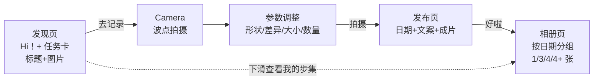
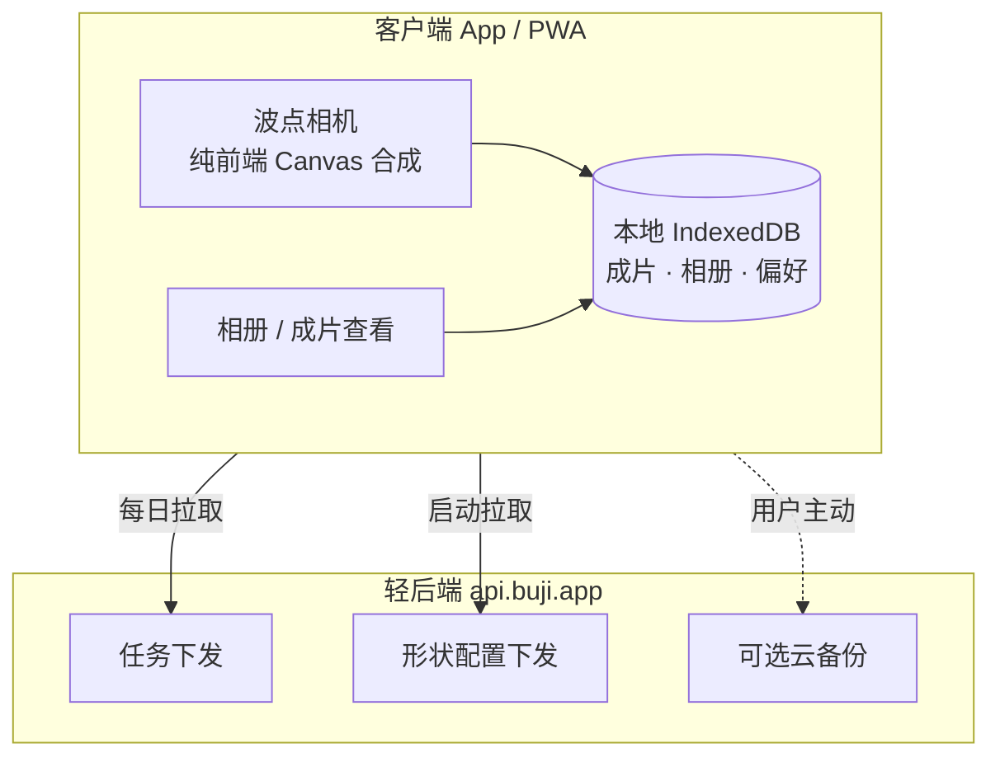

# 步集 BUJI · 后端 PRD / API 设计文档（轻后端版）

| 项 | 内容 |
|---|---|
| 版本 | v0.2（严格对齐 figma） |
| 定位 | 无账号 / 纯本地优先 + **轻后端** |
| 设计稿 | Figma「步集」node `322:2001` |
| 关联前端 | `live-template-camera.html`（波点相机）、`dot-mask-compositor`（合成 skill） |

---

## 1. 设计原则（先读这一节）

1. **严格对齐 figma**：数据模型只放设计稿里**真实出现**的信息，不引入设计稿外的字段（免得"信息没地方展示"）。
2. **无账号**：用匿名「设备 ID」标识，打开即用，零注册门槛。
3. **纯本地优先**：成片、相册、创作偏好全部存本地 IndexedDB，不上云。
4. **波点合成纯前端**：后端**零图像处理**，不碰 GPU、不做合成、不存原图（除非用户主动云备份）。
5. **后端只做 3 件事**：① 下发每日任务 ② 下发形状配置 ③ 可选云备份。

---

## 2. 业务链路（严格按 figma）



| 页面 | figma 真实内容 |
|---|---|
| 发现页 | `Hi！` / `今天去这里吧～` / 任务卡（**标题 + 图片**）/ `去记录` / `下滑查看我的步集` |
| Camera | 取景 + 变焦（0.5/1/2/3）+ 快门 + 随机位置 |
| 参数调整 | 形状（圆/雨滴/五角星/喵）+ `差异` / `大小` / `数量` |
| 发布页 | 日期（`6月24日`）+ 文案（用户输入）+ 成片 + `好啦` |
| 相册页 | 按日期分组 + 文案 + 多图网格（**1 / 3 / 4 / 4+ 张**响应式布局） |

---

## 3. 整体架构 & 职责边界



| 能力 | 归属 |
|---|---|
| 波点合成 / 成片 / 相册 / 创作偏好 | **前端本地** |
| 每日任务（标题+图片） | **后端** |
| 形状配置（圆/雨滴/星/喵） | **后端** |
| 云备份 | **后端（可选）** |

---

## 4. 数据模型

### 4.1 后端模型

```python
# 任务 —— 严格对齐 figma 任务卡：仅 标题 + 图片
Task {
  id:      str       # "t_drink_001"
  title:   str       # "去楼下便利店买一支没买过的饮料"
  image:   str       # 任务卡配图 URL
  active:  bool      # 是否上架（后端运营用，不展示）
}

# 形状配置 —— 对齐 figma 参数调整页的 4 种形状
ConfigBundle {
  version: str               # "2026.06.29"
  shapes:  list[Shape]
}
Shape {
  id:     str        # "circle" | "teardrop" | "star" | "char"
  name:   str        # "波点" | "雨滴" | "五角星" | "喵"
  type:   str
  params: dict       # 如 star: {points:5, innerRatio:0.42}；char: {char:"喵"}
}

# 可选云备份快照（备份码机制）
Backup {
  backup_code: str       # "BUJI-7K3Q"
  blob_url:    str       # 加密的本地数据快照（OSS）
  created_at:  datetime
  expires_at:  datetime  # 默认 90 天
}
```

> 说明：figma 参数调整页**只有形状 + 差异/大小/数量**，没有色板选择器。因此 config **暂不下发色板**，遮罩颜色按设计稿固定值（详见第 8 节待确认）。

### 4.2 本地模型（IndexedDB）

```ts
// 成片 —— 严格对齐 figma 发布页/相册页：仅 图片 + 文案 + 日期
interface Post {
  id: string;              // uuid
  imageBlob: Blob;         // 合成后的成片
  thumbBlob?: Blob;        // 缩略图（相册网格用）
  caption: string;         // 文案（"本人今天又出去玩了"）
  date: string;            // "2026-06-23"
  createdAt: number;
}

// 创作偏好（纯本地，记住上次设置）
interface CameraPref {
  lastShape: string;       // 'circle'|'teardrop'|'star'|'char'
  lastRatio: string;       // '1:1' ...
  variance: number;        // 差异 0~1
  dotCount: number;        // 数量
  dotSize: number;         // 大小
}
```

> **成片不关联任务**（已按你的要求去掉 taskId），也不存形状/色板等 figma 未展示的字段。

---

## 5. API 接口定义

### 5.0 通用约定

| 项 | 约定 |
|---|---|
| Base URL | `https://api.buji.app/v1` |
| 鉴权 | 请求头 `X-Device-Id: <uuid>`（首次启动本地生成，无需注册） |
| 返回格式 | `{ "code": 0, "msg": "ok", "data": {...} }`，`code=0` 成功 |

**错误码**：`0` 成功 / `1001` 参数错误 / `1002` 设备 ID 缺失 / `2001` 任务池为空 / `3001` 备份码不存在或过期 / `5000` 服务端错误。

---

### 5.1 任务模块

#### `GET /tasks/today` — 获取今日任务
返回当天的一个任务（标题 + 图片）。

```jsonc
// Response.data
{
  "task": {
    "id": "t_drink_001",
    "title": "去楼下便利店买一支没买过的饮料",
    "image": "https://cdn.buji.app/tasks/drink.png"
  },
  "date": "2026-06-29"
}
```

> **降级方案**：可把任务池做成静态 `tasks.json` 托管 CDN，前端本地随机抽取，运营改 JSON 即更新，连任务接口都省了。

---

### 5.2 形状配置模块

#### `GET /config` — 获取形状配置
客户端启动拉取、本地缓存，带 `version` 做增量。

```jsonc
// Request: ?version=2026.06.01（可选）
// Response.data
{
  "version": "2026.06.29",
  "changed": true,                       // false 则用本地缓存
  "shapes": [
    { "id": "circle",   "name": "波点",   "type": "circle",   "params": {} },
    { "id": "teardrop", "name": "雨滴",   "type": "teardrop", "params": {} },
    { "id": "star",     "name": "五角星", "type": "star",     "params": { "points": 5, "innerRatio": 0.42 } },
    { "id": "char",     "name": "喵",     "type": "char",     "params": { "char": "喵" } }
  ]
}
```

---

### 5.3 可选云备份模块（无账号迁移方案）

> 用「备份码」实现无账号的数据迁移：旧设备生成备份 → 得到码 → 新设备输码恢复。无需注册账号。

#### `POST /backup` — 上传本地数据快照
```jsonc
// Request（预签名直传或 multipart）
{ "blob": "<encrypted-bytes>" }
// Response.data
{ "backup_code": "BUJI-7K3Q", "expires_at": "2026-09-27T00:00:00Z" }
```

#### `GET /backup/{code}` — 用备份码恢复
```jsonc
// Response.data
{ "blob_url": "https://oss.buji.app/backups/xxx" }
```

---

## 6. MVP 优先级路线

```
P0（MVP，甚至可纯静态 JSON 实现，零服务器）
  · GET /tasks/today      （或 tasks.json）
  · GET /config           （或 config.json）
  · 成片/相册全在前端本地

P1（防丢数据）
  · POST /backup + GET /backup/{code}（备份码迁移）

P2（增长，未来再做）
  · 账号体系（可选登录）→ 解锁云同步 / 社交
```

---

## 7. 非功能性 & 降本

| 项 | 方案 |
|---|---|
| 图像处理 | **无**（合成在前端，缩略图也前端生成） |
| 存储成本 | MVP 不存图（在本地）；仅云备份用 OSS |
| 任务/配置更新 | 改后端或 CDN JSON，无需发版 |
| 鉴权 | 匿名设备 ID，无密码、无短信成本 |
| 离线 | 任务/配置本地缓存，断网仍能拍摄+看相册 |

---

## 8. 待确认问题

1. **遮罩颜色**：figma 参数页没有色板选择器——遮罩是固定一个颜色，还是有多色板（现有前端 `live-template-camera.html` 做了 6 个色板，需确认是否保留）？
2. **任务图片**：任务卡的图片是运营固定配图，还是有其他来源？
3. **云备份**：MVP 是否需要，还是 P2 再做？
4. **未来账号**：确认走"可选登录绑定本地数据"的渐进路径（详见下方答复）。

---

> 文档定稿后，可据此生成 FastAPI 接口骨架（参考 `ai--written-gen/backend` 工程风格：`main.py` + `routers/` + `models.py`）。
